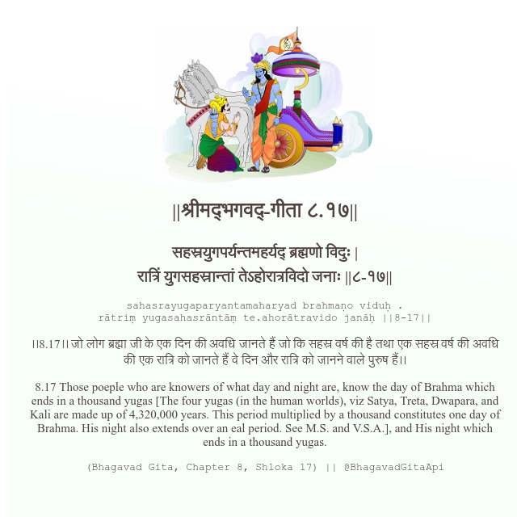

<h2>||श्रीमद्‍भगवद्‍-गीता ८.१७||</h2>
<h3>सहस्रयुगपर्यन्तमहर्यद् ब्रह्मणो विदुः | रात्रिं युगसहस्रान्तां तेऽहोरात्रविदो जनाः ||८-१७||</h3>
<pre>sahasrayugaparyantamaharyad brahmaṇo viduḥ . rātriṃ yugasahasrāntāṃ te.ahorātravido janāḥ ||8-17||</pre>

।।8.17।। जो लोग ब्रह्मा जी के एक दिन की अवधि जानते हैं जो कि सहस्र वर्ष की है तथा एक सहस्र वर्ष की अवधि की एक रात्रि को जानते हैं वे दिन और रात्रि को जानने वाले पुरुष हैं।।

<pre>(Bhagavad Gita, Chapter 8, Shloka 17) || @BhagavadGitaApi</pre>
https://docs.bhagavadgitaapi.in/

#API #bhagavadgitaapi #slok #nodejs #js #api #gitaapi #krishna #hinduism #vedic #ISKCON #shreemadbhagavadgita #technology

