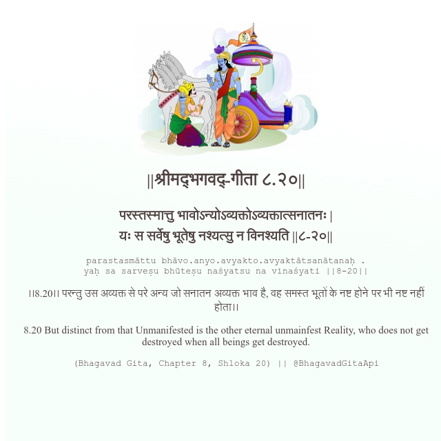

<h2>||श्रीमद्‍भगवद्‍-गीता ८.२०||</h2>
<h3>परस्तस्मात्तु भावोऽन्योऽव्यक्तोऽव्यक्तात्सनातनः | यः स सर्वेषु भूतेषु नश्यत्सु न विनश्यति ||८-२०||</h3>
<pre>parastasmāttu bhāvo.anyo.avyakto.avyaktātsanātanaḥ . yaḥ sa sarveṣu bhūteṣu naśyatsu na vinaśyati ||8-20||</pre>

।।8.20।। परन्तु उस अव्यक्त से परे अन्य जो सनातन अव्यक्त भाव है, वह समस्त भूतों के नष्ट होने पर भी नष्ट नहीं होता।।

<pre>(Bhagavad Gita, Chapter 8, Shloka 20) || @BhagavadGitaApi</pre>
https://docs.bhagavadgitaapi.in/

#API #bhagavadgitaapi #slok #nodejs #js #api #gitaapi #krishna #hinduism #vedic #ISKCON #shreemadbhagavadgita #technology

