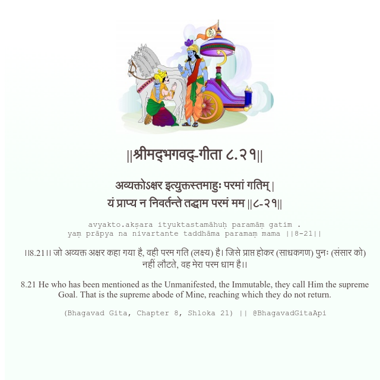

<h2>||श्रीमद्‍भगवद्‍-गीता ८.२१||</h2>
<h3>अव्यक्तोऽक्षर इत्युक्तस्तमाहुः परमां गतिम् | यं प्राप्य न निवर्तन्ते तद्धाम परमं मम ||८-२१||</h3>
<pre>avyakto.akṣara ityuktastamāhuḥ paramāṃ gatim . yaṃ prāpya na nivartante taddhāma paramaṃ mama ||8-21||</pre>

।।8.21।। जो अव्यक्त अक्षर कहा गया है, वही परम गति (लक्ष्य) है। जिसे प्राप्त होकर (साधकगण) पुनः (संसार को) नहीं लौटते, वह मेरा परम धाम है।।

<pre>(Bhagavad Gita, Chapter 8, Shloka 21) || @BhagavadGitaApi</pre>
https://vedicscriptures.github.io/

#API #bhagavadgitaapi #slok #nodejs #js #api #gitaapi #krishna #hinduism #vedic #ISKCON #shreemadbhagavadgita #technology

