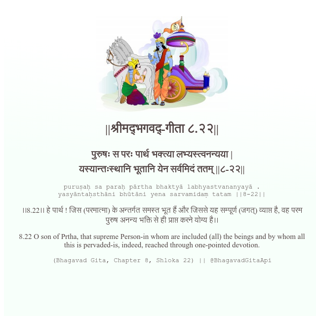

<h2>||श्रीमद्‍भगवद्‍-गीता ८.२२||</h2>
<h3>पुरुषः स परः पार्थ भक्त्या लभ्यस्त्वनन्यया | यस्यान्तःस्थानि भूतानि येन सर्वमिदं ततम् ||८-२२||</h3>
<pre>puruṣaḥ sa paraḥ pārtha bhaktyā labhyastvananyayā . yasyāntaḥsthāni bhūtāni yena sarvamidaṃ tatam ||8-22||</pre>

।।8.22।। हे पार्थ ! जिस (परमात्मा) के अन्तर्गत समस्त भूत हैं और जिससे यह सम्पूर्ण (जगत्) व्याप्त है, वह परम पुरुष अनन्य भक्ति से ही प्राप्त करने योग्य है।।

<pre>(Bhagavad Gita, Chapter 8, Shloka 22) || @BhagavadGitaApi</pre>
https://docs.bhagavadgitaapi.in/

#API #bhagavadgitaapi #slok #nodejs #js #api #gitaapi #krishna #hinduism #vedic #ISKCON #shreemadbhagavadgita #technology

