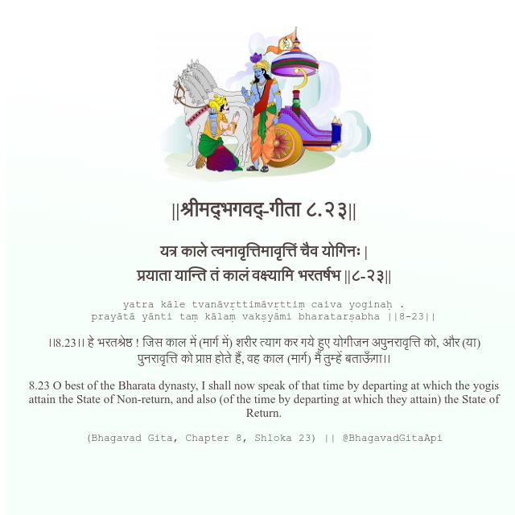

<h2>||श्रीमद्‍भगवद्‍-गीता ८.२३||</h2>
<h3>यत्र काले त्वनावृत्तिमावृत्तिं चैव योगिनः | प्रयाता यान्ति तं कालं वक्ष्यामि भरतर्षभ ||८-२३||</h3>
<pre>yatra kāle tvanāvṛttimāvṛttiṃ caiva yoginaḥ . prayātā yānti taṃ kālaṃ vakṣyāmi bharatarṣabha ||8-23||</pre>

।।8.23।। हे भरतश्रेष्ठ ! जिस काल में (मार्ग में) शरीर त्याग कर गये हुए योगीजन अपुनरावृत्ति को, और (या) पुनरावृत्ति को प्राप्त होते हैं, वह काल (मार्ग) मैं तुम्हें बताऊँगा।।

<pre>(Bhagavad Gita, Chapter 8, Shloka 23) || @BhagavadGitaApi</pre>
https://vedicscriptures.github.io/

#API #bhagavadgitaapi #slok #nodejs #js #api #gitaapi #krishna #hinduism #vedic #ISKCON #shreemadbhagavadgita #technology

