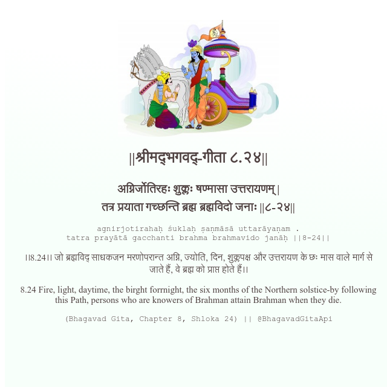

<h2>||श्रीमद्‍भगवद्‍-गीता ८.२४||</h2>
<h3>अग्निर्जोतिरहः शुक्लः षण्मासा उत्तरायणम् | तत्र प्रयाता गच्छन्ति ब्रह्म ब्रह्मविदो जनाः ||८-२४||</h3>
<pre>agnirjotirahaḥ śuklaḥ ṣaṇmāsā uttarāyaṇam . tatra prayātā gacchanti brahma brahmavido janāḥ ||8-24||</pre>

।।8.24।। जो ब्रह्मविद् साधकजन मरणोपरान्त अग्नि, ज्योति, दिन, शुक्लपक्ष और उत्तरायण के छः मास वाले मार्ग से जाते हैं, वे ब्रह्म को प्राप्त होते हैं।।

<pre>(Bhagavad Gita, Chapter 8, Shloka 24) || @BhagavadGitaApi</pre>
https://vedicscriptures.github.io/

#API #bhagavadgitaapi #slok #nodejs #js #api #gitaapi #krishna #hinduism #vedic #ISKCON #shreemadbhagavadgita #technology

