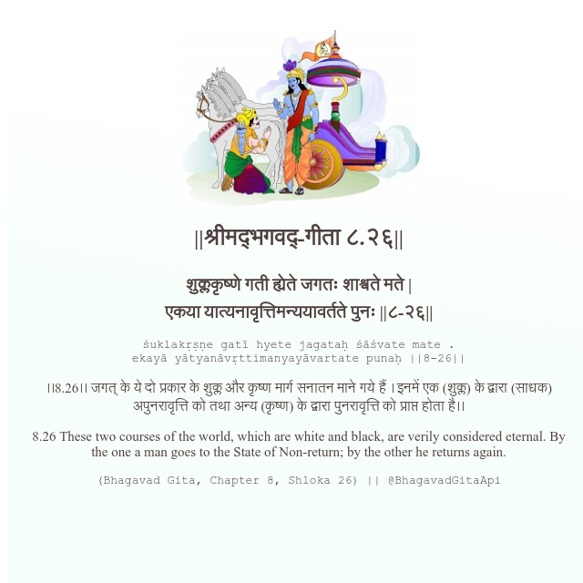

<h2>||श्रीमद्‍भगवद्‍-गीता ८.२६||</h2>
<h3>शुक्लकृष्णे गती ह्येते जगतः शाश्वते मते | एकया यात्यनावृत्तिमन्ययावर्तते पुनः ||८-२६||</h3>
<pre>śuklakṛṣṇe gatī hyete jagataḥ śāśvate mate . ekayā yātyanāvṛttimanyayāvartate punaḥ ||8-26||</pre>

।।8.26।। जगत् के ये दो प्रकार के शुक्ल और कृष्ण मार्ग सनातन माने गये हैं । इनमें एक (शुक्ल) के द्वारा (साधक) अपुनरावृत्ति को तथा अन्य (कृष्ण) के द्वारा पुनरावृत्ति को प्राप्त होता है।।

<pre>(Bhagavad Gita, Chapter 8, Shloka 26) || @BhagavadGitaApi</pre>
https://bhagavadgitaapi.in/

#API #bhagavadgitaapi #slok #nodejs #js #api #gitaapi #krishna #hinduism #vedic #ISKCON #shreemadbhagavadgita #technology

