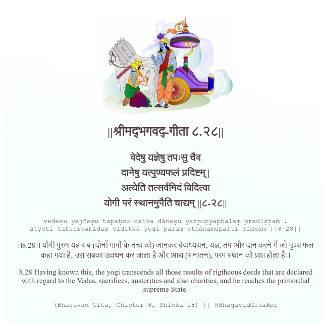

<h2>||श्रीमद्‍भगवद्‍-गीता ८.२८||</h2>
<h3>वेदेषु यज्ञेषु तपःसु चैव दानेषु यत्पुण्यफलं प्रदिष्टम् | अत्येति तत्सर्वमिदं विदित्वा योगी परं स्थानमुपैति चाद्यम् ||८-२८||</h3>
<pre>vedeṣu yajñeṣu tapaḥsu caiva dāneṣu yatpuṇyaphalaṃ pradiṣṭam . atyeti tatsarvamidaṃ viditvā yogī paraṃ sthānamupaiti cādyam ||8-28||</pre>

।।8.28।। योगी पुरुष यह सब (दोनों मार्गों के तत्त्व को) जानकर वेदाध्ययन, यज्ञ, तप और दान करने में जो पुण्य फल कहा गया है, उस सबका उल्लंघन कर जाता है और आद्य (सनातन), परम स्थान को प्राप्त होता है।।

<pre>(Bhagavad Gita, Chapter 8, Shloka 28) || @BhagavadGitaApi</pre>
https://bhagavadgitaapi.in/

#API #bhagavadgitaapi #slok #nodejs #js #api #gitaapi #krishna #hinduism #vedic #ISKCON #shreemadbhagavadgita #technology

