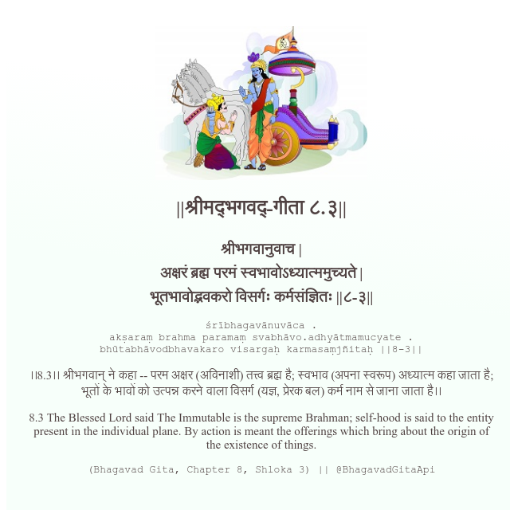

<h2>||श्रीमद्‍भगवद्‍-गीता ८.३||</h2>
<h3>श्रीभगवानुवाच | अक्षरं ब्रह्म परमं स्वभावोऽध्यात्ममुच्यते | भूतभावोद्भवकरो विसर्गः कर्मसंज्ञितः ||८-३||</h3>
<pre>śrībhagavānuvāca . akṣaraṃ brahma paramaṃ svabhāvo.adhyātmamucyate . bhūtabhāvodbhavakaro visargaḥ karmasaṃjñitaḥ ||8-3||</pre>

।।8.3।। श्रीभगवान् ने कहा -- परम अक्षर (अविनाशी) तत्त्व ब्रह्म है; स्वभाव (अपना स्वरूप) अध्यात्म कहा जाता है; भूतों के भावों को उत्पन्न करने वाला विसर्ग (यज्ञ, प्रेरक बल) कर्म नाम से जाना जाता है।।

<pre>(Bhagavad Gita, Chapter 8, Shloka 3) || @BhagavadGitaApi</pre>
https://vedicscriptures.github.io/

#API #bhagavadgitaapi #slok #nodejs #js #api #gitaapi #krishna #hinduism #vedic #ISKCON #shreemadbhagavadgita #technology

