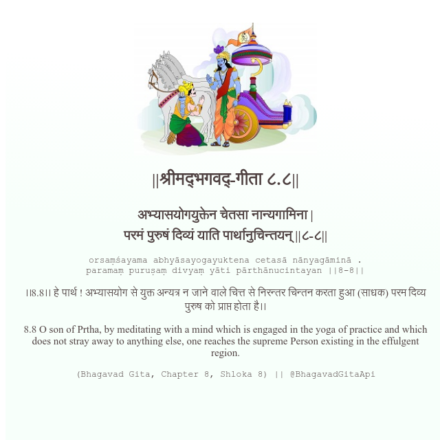

<h2>||श्रीमद्‍भगवद्‍-गीता ८.८||</h2>
<h3>अभ्यासयोगयुक्तेन चेतसा नान्यगामिना | परमं पुरुषं दिव्यं याति पार्थानुचिन्तयन् ||८-८||</h3>
<pre>orsaṃśayama abhyāsayogayuktena cetasā nānyagāminā . paramaṃ puruṣaṃ divyaṃ yāti pārthānucintayan ||8-8||</pre>

।।8.8।। हे पार्थ ! अभ्यासयोग से युक्त अन्यत्र न जाने वाले चित्त से निरन्तर चिन्तन करता हुआ (साधक) परम दिव्य पुरुष को प्राप्त होता है।।

<pre>(Bhagavad Gita, Chapter 8, Shloka 8) || @BhagavadGitaApi</pre>
https://docs.bhagavadgitaapi.in/

#API #bhagavadgitaapi #slok #nodejs #js #api #gitaapi #krishna #hinduism #vedic #ISKCON #shreemadbhagavadgita #technology

