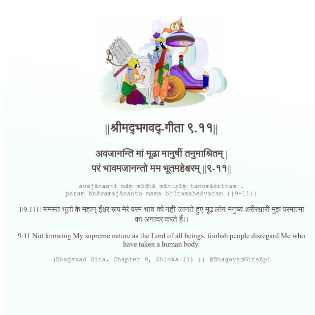

<h2>||श्रीमद्‍भगवद्‍-गीता ९.११||</h2>
<h3>अवजानन्ति मां मूढा मानुषीं तनुमाश्रितम् | परं भावमजानन्तो मम भूतमहेश्वरम् ||९-११||</h3>
<pre>avajānanti māṃ mūḍhā mānuṣīṃ tanumāśritam . paraṃ bhāvamajānanto mama bhūtamaheśvaram ||9-11||</pre>

।।9.11।। समस्त भूतों के महान् ईश्वर रूप मेरे परम भाव को नहीं जानते हुए मूढ़ लोग मनुष्य शरीरधारी मुझ परमात्मा का अनादर करते हैं।।

<pre>(Bhagavad Gita, Chapter 9, Shloka 11) || @BhagavadGitaApi</pre>
https://bhagavadgitaapi.in/

#API #bhagavadgitaapi #slok #nodejs #js #api #gitaapi #krishna #hinduism #vedic #ISKCON #shreemadbhagavadgita #technology

