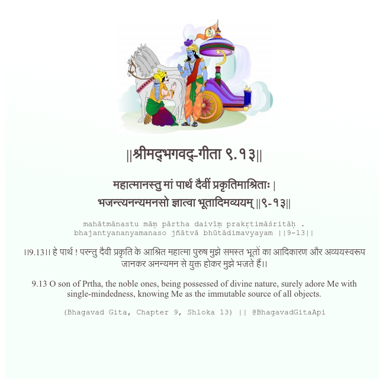

<h2>||श्रीमद्‍भगवद्‍-गीता ९.१३||</h2>
<h3>महात्मानस्तु मां पार्थ दैवीं प्रकृतिमाश्रिताः | भजन्त्यनन्यमनसो ज्ञात्वा भूतादिमव्ययम् ||९-१३||</h3>
<pre>mahātmānastu māṃ pārtha daivīṃ prakṛtimāśritāḥ . bhajantyananyamanaso jñātvā bhūtādimavyayam ||9-13||</pre>

।।9.13।। हे पार्थ ! परन्तु दैवी प्रकृति के आश्रित महात्मा पुरुष मुझे समस्त भूतों का आदिकारण और अव्ययस्वरूप जानकर अनन्यमन से युक्त होकर मुझे भजते हैं।।

<pre>(Bhagavad Gita, Chapter 9, Shloka 13) || @BhagavadGitaApi</pre>
https://vedicscriptures.github.io/

#API #bhagavadgitaapi #slok #nodejs #js #api #gitaapi #krishna #hinduism #vedic #ISKCON #shreemadbhagavadgita #technology

