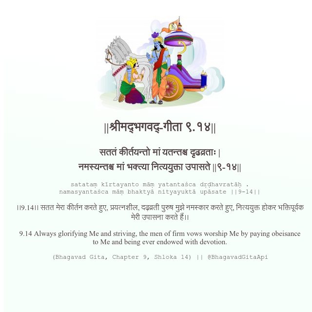

<h2>||श्रीमद्‍भगवद्‍-गीता ९.१४||</h2>
<h3>सततं कीर्तयन्तो मां यतन्तश्च दृढव्रताः | नमस्यन्तश्च मां भक्त्या नित्ययुक्ता उपासते ||९-१४||</h3>
<pre>satataṃ kīrtayanto māṃ yatantaśca dṛḍhavratāḥ . namasyantaśca māṃ bhaktyā nityayuktā upāsate ||9-14||</pre>

।।9.14।। सतत मेरा कीर्तन करते हुए, प्रयत्नशील, दढ़व्रती पुरुष मुझे नमस्कार करते हुए, नित्ययुक्त होकर भक्तिपूर्वक मेरी उपासना करते हैं।।

<pre>(Bhagavad Gita, Chapter 9, Shloka 14) || @BhagavadGitaApi</pre>
https://bhagavadgitaapi.in/

#API #bhagavadgitaapi #slok #nodejs #js #api #gitaapi #krishna #hinduism #vedic #ISKCON #shreemadbhagavadgita #technology

