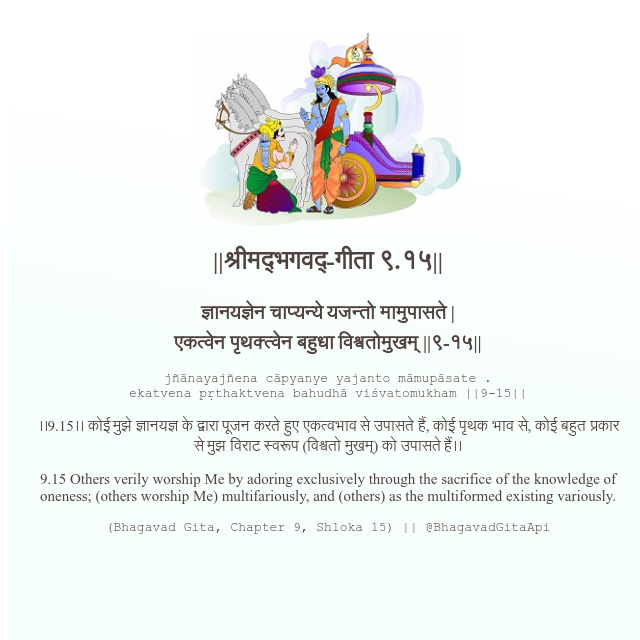

<h2>||श्रीमद्‍भगवद्‍-गीता ९.१५||</h2>
<h3>ज्ञानयज्ञेन चाप्यन्ये यजन्तो मामुपासते | एकत्वेन पृथक्त्वेन बहुधा विश्वतोमुखम् ||९-१५||</h3>
<pre>jñānayajñena cāpyanye yajanto māmupāsate . ekatvena pṛthaktvena bahudhā viśvatomukham ||9-15||</pre>

।।9.15।। कोई मुझे ज्ञानयज्ञ के द्वारा पूजन करते हुए एकत्वभाव से उपासते हैं, कोई पृथक भाव से, कोई बहुत प्रकार से मुझ विराट स्वरूप (विश्वतो मुखम्) को उपासते हैं।।

<pre>(Bhagavad Gita, Chapter 9, Shloka 15) || @BhagavadGitaApi</pre>
https://docs.bhagavadgitaapi.in/

#API #bhagavadgitaapi #slok #nodejs #js #api #gitaapi #krishna #hinduism #vedic #ISKCON #shreemadbhagavadgita #technology

