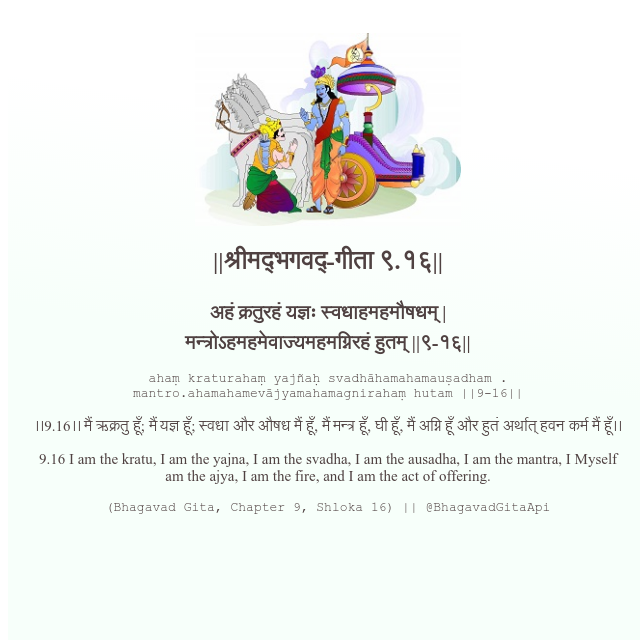

<h2>||श्रीमद्‍भगवद्‍-गीता ९.१६||</h2>
<h3>अहं क्रतुरहं यज्ञः स्वधाहमहमौषधम् | मन्त्रोऽहमहमेवाज्यमहमग्निरहं हुतम् ||९-१६||</h3>
<pre>ahaṃ kraturahaṃ yajñaḥ svadhāhamahamauṣadham . mantro.ahamahamevājyamahamagnirahaṃ hutam ||9-16||</pre>

।।9.16।। मैं ऋक्रतु हूँ; मैं यज्ञ हूँ; स्वधा और औषध मैं हूँ, मैं मन्त्र हूँ, घी हूँ, मैं अग्नि हूँ और हुतं अर्थात् हवन कर्म मैं हूँ।।

<pre>(Bhagavad Gita, Chapter 9, Shloka 16) || @BhagavadGitaApi</pre>
https://vedicscriptures.github.io/

#API #bhagavadgitaapi #slok #nodejs #js #api #gitaapi #krishna #hinduism #vedic #ISKCON #shreemadbhagavadgita #technology

