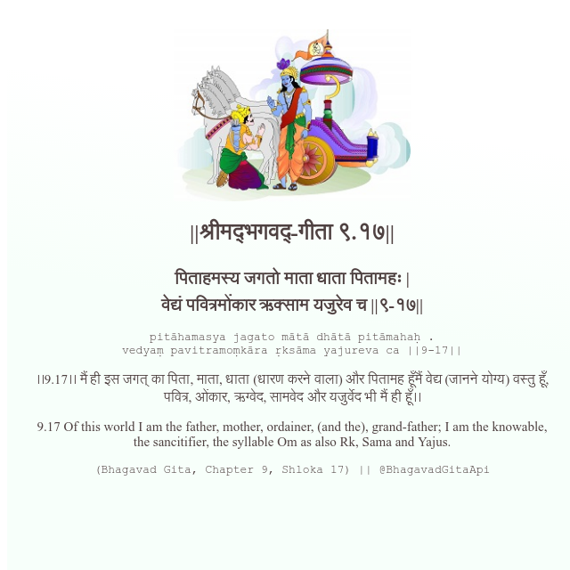

<h2>||श्रीमद्‍भगवद्‍-गीता ९.१७||</h2>
<h3>पिताहमस्य जगतो माता धाता पितामहः | वेद्यं पवित्रमोंकार ऋक्साम यजुरेव च ||९-१७||</h3>
<pre>pitāhamasya jagato mātā dhātā pitāmahaḥ . vedyaṃ pavitramoṃkāra ṛksāma yajureva ca ||9-17||</pre>

।।9.17।। मैं ही इस जगत् का पिता, माता, धाता (धारण करने वाला) और पितामह हूँमैं वेद्य (जानने योग्य) वस्तु हूँ, पवित्र, ओंकार, ऋग्वेद, सामवेद और यजुर्वेद भी मैं ही हूँ।।

<pre>(Bhagavad Gita, Chapter 9, Shloka 17) || @BhagavadGitaApi</pre>
https://docs.bhagavadgitaapi.in/

#API #bhagavadgitaapi #slok #nodejs #js #api #gitaapi #krishna #hinduism #vedic #ISKCON #shreemadbhagavadgita #technology

