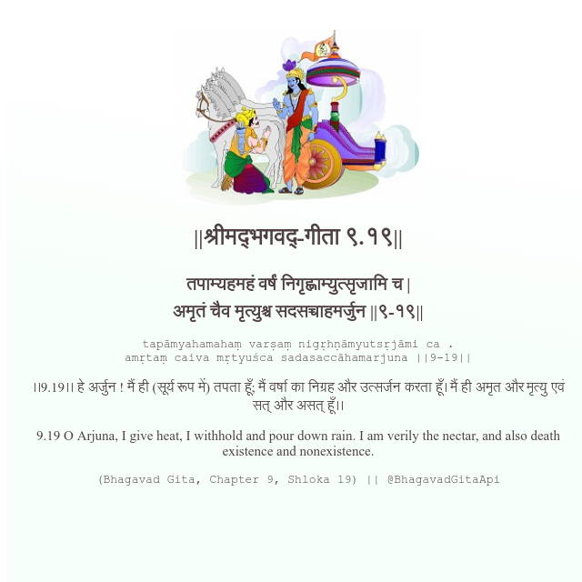

<h2>||श्रीमद्‍भगवद्‍-गीता ९.१९||</h2>
<h3>तपाम्यहमहं वर्षं निगृह्णाम्युत्सृजामि च | अमृतं चैव मृत्युश्च सदसच्चाहमर्जुन ||९-१९||</h3>
<pre>tapāmyahamahaṃ varṣaṃ nigṛhṇāmyutsṛjāmi ca . amṛtaṃ caiva mṛtyuśca sadasaccāhamarjuna ||9-19||</pre>

।।9.19।। हे अर्जुन ! मैं ही (सूर्य रूप में) तपता हूँ; मैं वर्षा का निग्रह और उत्सर्जन करता हूँ। मैं ही अमृत और मृत्यु एवं सत् और असत् हूँ।।

<pre>(Bhagavad Gita, Chapter 9, Shloka 19) || @BhagavadGitaApi</pre>
https://vedicscriptures.github.io/

#API #bhagavadgitaapi #slok #nodejs #js #api #gitaapi #krishna #hinduism #vedic #ISKCON #shreemadbhagavadgita #technology

