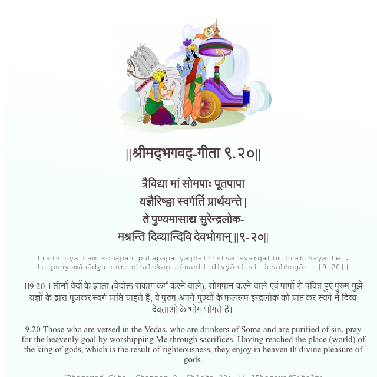

<h2>||श्रीमद्‍भगवद्‍-गीता ९.२०||</h2>
<h3>त्रैविद्या मां सोमपाः पूतपापा यज्ञैरिष्ट्वा स्वर्गतिं प्रार्थयन्ते | ते पुण्यमासाद्य सुरेन्द्रलोक- मश्नन्ति दिव्यान्दिवि देवभोगान् ||९-२०||</h3>
<pre>traividyā māṃ somapāḥ pūtapāpā yajñairiṣṭvā svargatiṃ prārthayante . te puṇyamāsādya surendralokaṃ aśnanti divyāndivi devabhogān ||9-20||</pre>

।।9.20।। तीनों वेदों के ज्ञाता (वेदोक्त सकाम कर्म करने वाले), सोमपान करने वाले एवं पापों से पवित्र हुए पुरुष मुझे यज्ञों के द्वारा पूजकर स्वर्ग प्राप्ति चाहते हैं; वे पुरुष अपने पुण्यों के फलरूप इन्द्रलोक को प्राप्त कर स्वर्ग में दिव्य देवताओं के भोग भोगते हैं।।

<pre>(Bhagavad Gita, Chapter 9, Shloka 20) || @BhagavadGitaApi</pre>
https://docs.bhagavadgitaapi.in/

#API #bhagavadgitaapi #slok #nodejs #js #api #gitaapi #krishna #hinduism #vedic #ISKCON #shreemadbhagavadgita #technology

