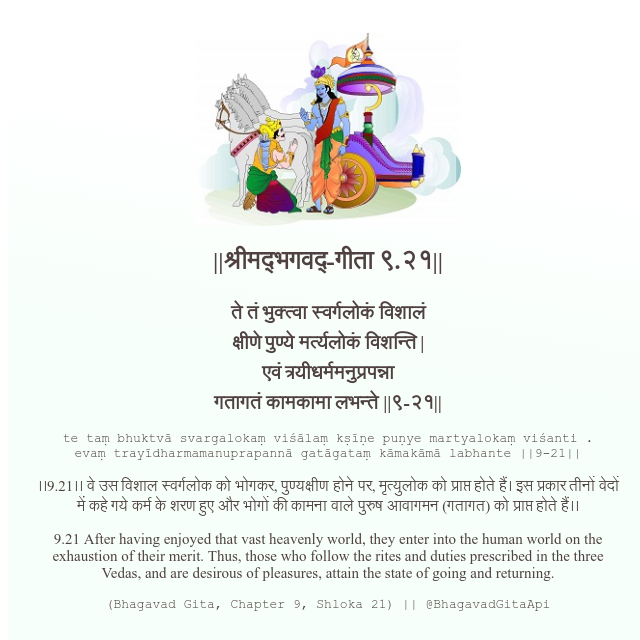

<h2>||श्रीमद्‍भगवद्‍-गीता ९.२१||</h2>
<h3>ते तं भुक्त्वा स्वर्गलोकं विशालं क्षीणे पुण्ये मर्त्यलोकं विशन्ति | एवं त्रयीधर्ममनुप्रपन्ना गतागतं कामकामा लभन्ते ||९-२१||</h3>
<pre>te taṃ bhuktvā svargalokaṃ viśālaṃ kṣīṇe puṇye martyalokaṃ viśanti . evaṃ trayīdharmamanuprapannā gatāgataṃ kāmakāmā labhante ||9-21||</pre>

।।9.21।। वे उस विशाल स्वर्गलोक को भोगकर, पुण्यक्षीण होने पर, मृत्युलोक को प्राप्त होते हैं। इस प्रकार तीनों वेदों में कहे गये कर्म के शरण हुए और भोगों की कामना वाले पुरुष आवागमन (गतागत) को प्राप्त होते हैं।।

<pre>(Bhagavad Gita, Chapter 9, Shloka 21) || @BhagavadGitaApi</pre>
https://docs.bhagavadgitaapi.in/

#API #bhagavadgitaapi #slok #nodejs #js #api #gitaapi #krishna #hinduism #vedic #ISKCON #shreemadbhagavadgita #technology

