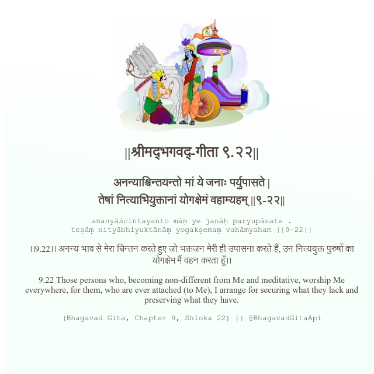

<h2>||श्रीमद्‍भगवद्‍-गीता ९.२२||</h2>
<h3>अनन्याश्चिन्तयन्तो मां ये जनाः पर्युपासते | तेषां नित्याभियुक्तानां योगक्षेमं वहाम्यहम् ||९-२२||</h3>
<pre>ananyāścintayanto māṃ ye janāḥ paryupāsate . teṣāṃ nityābhiyuktānāṃ yogakṣemaṃ vahāmyaham ||9-22||</pre>

।।9.22।। अनन्य भाव से मेरा चिन्तन करते हुए जो भक्तजन मेरी ही उपासना करते हैं, उन नित्ययुक्त पुरुषों का योगक्षेम मैं वहन करता हूँ।।

<pre>(Bhagavad Gita, Chapter 9, Shloka 22) || @BhagavadGitaApi</pre>
https://vedicscriptures.github.io/

#API #bhagavadgitaapi #slok #nodejs #js #api #gitaapi #krishna #hinduism #vedic #ISKCON #shreemadbhagavadgita #technology

