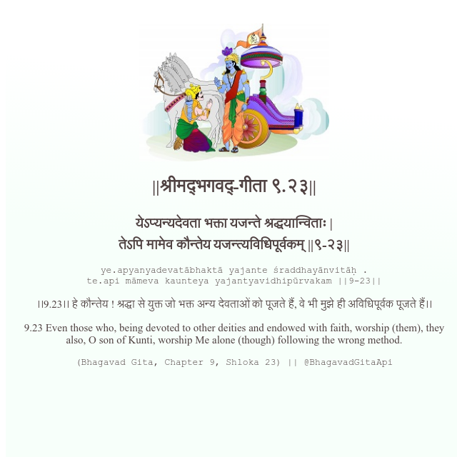

<h2>||श्रीमद्‍भगवद्‍-गीता ९.२३||</h2>
<h3>येऽप्यन्यदेवता भक्ता यजन्ते श्रद्धयान्विताः | तेऽपि मामेव कौन्तेय यजन्त्यविधिपूर्वकम् ||९-२३||</h3>
<pre>ye.apyanyadevatābhaktā yajante śraddhayānvitāḥ . te.api māmeva kaunteya yajantyavidhipūrvakam ||9-23||</pre>

।।9.23।। हे कौन्तेय ! श्रद्धा से युक्त जो भक्त अन्य देवताओं को पूजते हैं, वे भी मुझे ही अविधिपूर्वक पूजते हैं।।

<pre>(Bhagavad Gita, Chapter 9, Shloka 23) || @BhagavadGitaApi</pre>
https://bhagavadgitaapi.in/

#API #bhagavadgitaapi #slok #nodejs #js #api #gitaapi #krishna #hinduism #vedic #ISKCON #shreemadbhagavadgita #technology

