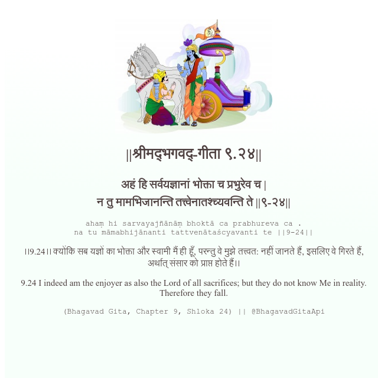

<h2>||श्रीमद्‍भगवद्‍-गीता ९.२४||</h2>
<h3>अहं हि सर्वयज्ञानां भोक्ता च प्रभुरेव च | न तु मामभिजानन्ति तत्त्वेनातश्च्यवन्ति ते ||९-२४||</h3>
<pre>ahaṃ hi sarvayajñānāṃ bhoktā ca prabhureva ca . na tu māmabhijānanti tattvenātaścyavanti te ||9-24||</pre>

।।9.24।। क्योंकि सब यज्ञों का भोक्ता और स्वामी मैं ही हूँ, परन्तु वे मुझे तत्त्वत: नहीं जानते हैं, इसलिए वे गिरते हैं, अर्थात् संसार को प्राप्त होते हैं।।

<pre>(Bhagavad Gita, Chapter 9, Shloka 24) || @BhagavadGitaApi</pre>
https://docs.bhagavadgitaapi.in/

#API #bhagavadgitaapi #slok #nodejs #js #api #gitaapi #krishna #hinduism #vedic #ISKCON #shreemadbhagavadgita #technology

