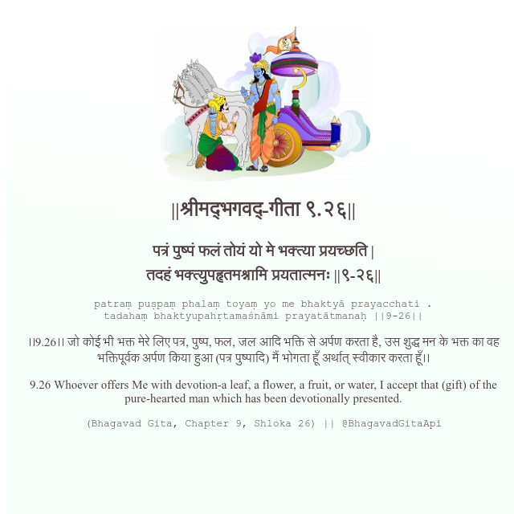

<h2>||श्रीमद्‍भगवद्‍-गीता ९.२६||</h2>
<h3>पत्रं पुष्पं फलं तोयं यो मे भक्त्या प्रयच्छति | तदहं भक्त्युपहृतमश्नामि प्रयतात्मनः ||९-२६||</h3>
<pre>patraṃ puṣpaṃ phalaṃ toyaṃ yo me bhaktyā prayacchati . tadahaṃ bhaktyupahṛtamaśnāmi prayatātmanaḥ ||9-26||</pre>

।।9.26।। जो कोई भी भक्त मेरे लिए पत्र, पुष्प, फल, जल आदि भक्ति से अर्पण करता है, उस शुद्ध मन के भक्त का वह भक्तिपूर्वक अर्पण किया हुआ (पत्र पुष्पादि) मैं भोगता हूँ अर्थात् स्वीकार करता हूँ।।

<pre>(Bhagavad Gita, Chapter 9, Shloka 26) || @BhagavadGitaApi</pre>
https://docs.bhagavadgitaapi.in/

#API #bhagavadgitaapi #slok #nodejs #js #api #gitaapi #krishna #hinduism #vedic #ISKCON #shreemadbhagavadgita #technology

