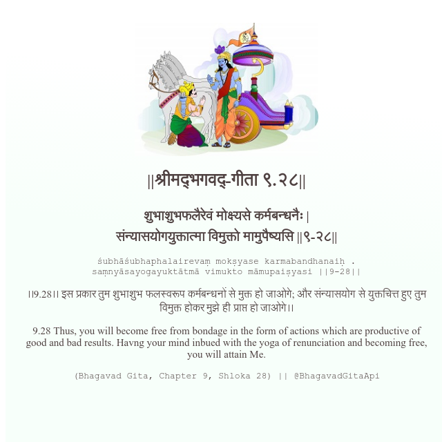

<h2>||श्रीमद्‍भगवद्‍-गीता ९.२८||</h2>
<h3>शुभाशुभफलैरेवं मोक्ष्यसे कर्मबन्धनैः | संन्यासयोगयुक्तात्मा विमुक्तो मामुपैष्यसि ||९-२८||</h3>
<pre>śubhāśubhaphalairevaṃ mokṣyase karmabandhanaiḥ . saṃnyāsayogayuktātmā vimukto māmupaiṣyasi ||9-28||</pre>

।।9.28।। इस प्रकार तुम शुभाशुभ फलस्वरूप कर्मबन्धनों से मुक्त हो जाओगे; और संन्यासयोग से युक्तचित्त हुए तुम विमुक्त होकर मुझे ही प्राप्त हो जाओगे।।

<pre>(Bhagavad Gita, Chapter 9, Shloka 28) || @BhagavadGitaApi</pre>
https://docs.bhagavadgitaapi.in/

#API #bhagavadgitaapi #slok #nodejs #js #api #gitaapi #krishna #hinduism #vedic #ISKCON #shreemadbhagavadgita #technology

