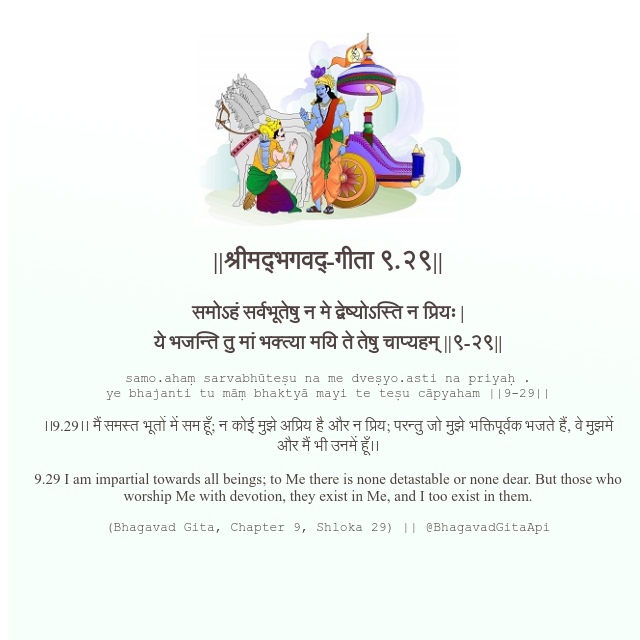

<h2>||श्रीमद्‍भगवद्‍-गीता ९.२९||</h2>
<h3>समोऽहं सर्वभूतेषु न मे द्वेष्योऽस्ति न प्रियः | ये भजन्ति तु मां भक्त्या मयि ते तेषु चाप्यहम् ||९-२९||</h3>
<pre>samo.ahaṃ sarvabhūteṣu na me dveṣyo.asti na priyaḥ . ye bhajanti tu māṃ bhaktyā mayi te teṣu cāpyaham ||9-29||</pre>

।।9.29।। मैं समस्त भूतों में सम हूँ; न कोई मुझे अप्रिय है और न प्रिय; परन्तु जो मुझे भक्तिपूर्वक भजते हैं, वे मुझमें और मैं भी उनमें हूँ।।

<pre>(Bhagavad Gita, Chapter 9, Shloka 29) || @BhagavadGitaApi</pre>
https://vedicscriptures.github.io/

#API #bhagavadgitaapi #slok #nodejs #js #api #gitaapi #krishna #hinduism #vedic #ISKCON #shreemadbhagavadgita #technology

