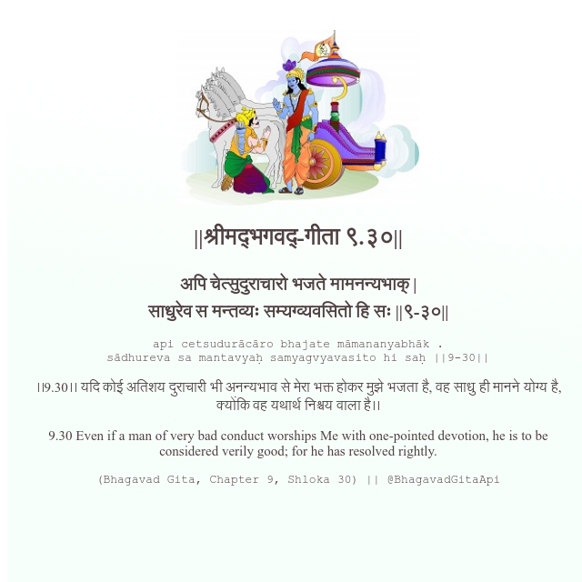

<h2>||श्रीमद्‍भगवद्‍-गीता ९.३०||</h2>
<h3>अपि चेत्सुदुराचारो भजते मामनन्यभाक् | साधुरेव स मन्तव्यः सम्यग्व्यवसितो हि सः ||९-३०||</h3>
<pre>api cetsudurācāro bhajate māmananyabhāk . sādhureva sa mantavyaḥ samyagvyavasito hi saḥ ||9-30||</pre>

।।9.30।। यदि कोई अतिशय दुराचारी भी अनन्यभाव से मेरा भक्त होकर मुझे भजता है, वह साधु ही मानने योग्य है, क्योंकि वह यथार्थ निश्चय वाला है।।

<pre>(Bhagavad Gita, Chapter 9, Shloka 30) || @BhagavadGitaApi</pre>
https://bhagavadgitaapi.in/

#API #bhagavadgitaapi #slok #nodejs #js #api #gitaapi #krishna #hinduism #vedic #ISKCON #shreemadbhagavadgita #technology

