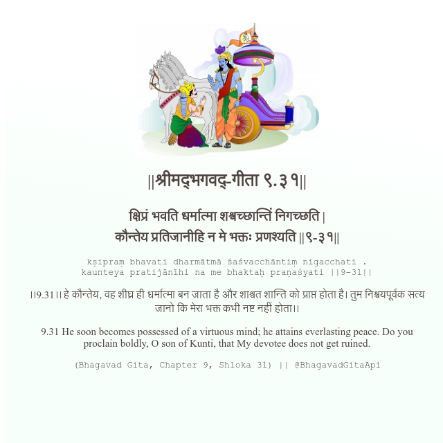

<h2>||श्रीमद्‍भगवद्‍-गीता ९.३१||</h2>
<h3>क्षिप्रं भवति धर्मात्मा शश्वच्छान्तिं निगच्छति | कौन्तेय प्रतिजानीहि न मे भक्तः प्रणश्यति ||९-३१||</h3>
<pre>kṣipraṃ bhavati dharmātmā śaśvacchāntiṃ nigacchati . kaunteya pratijānīhi na me bhaktaḥ praṇaśyati ||9-31||</pre>

।।9.31।। हे कौन्तेय, वह शीघ्र ही धर्मात्मा बन जाता है और शाश्वत शान्ति को प्राप्त होता है। तुम निश्चयपूर्वक सत्य जानो कि मेरा भक्त कभी नष्ट नहीं होता।।

<pre>(Bhagavad Gita, Chapter 9, Shloka 31) || @BhagavadGitaApi</pre>
https://docs.bhagavadgitaapi.in/

#API #bhagavadgitaapi #slok #nodejs #js #api #gitaapi #krishna #hinduism #vedic #ISKCON #shreemadbhagavadgita #technology

