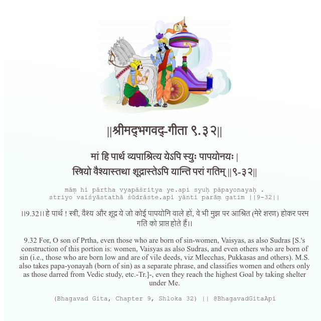

<h2>||श्रीमद्‍भगवद्‍-गीता ९.३२||</h2>
<h3>मां हि पार्थ व्यपाश्रित्य येऽपि स्युः पापयोनयः | स्त्रियो वैश्यास्तथा शूद्रास्तेऽपि यान्ति परां गतिम् ||९-३२||</h3>
<pre>māṃ hi pārtha vyapāśritya ye.api syuḥ pāpayonayaḥ . striyo vaiśyāstathā śūdrāste.api yānti parāṃ gatim ||9-32||</pre>

।।9.32।। हे पार्थ ! स्त्री, वैश्य और शूद्र ये जो कोई पापयोनि वाले हों, वे भी मुझ पर आश्रित (मेरे शरण) होकर परम गति को प्राप्त होते हैं।।

<pre>(Bhagavad Gita, Chapter 9, Shloka 32) || @BhagavadGitaApi</pre>
https://bhagavadgitaapi.in/

#API #bhagavadgitaapi #slok #nodejs #js #api #gitaapi #krishna #hinduism #vedic #ISKCON #shreemadbhagavadgita #technology

