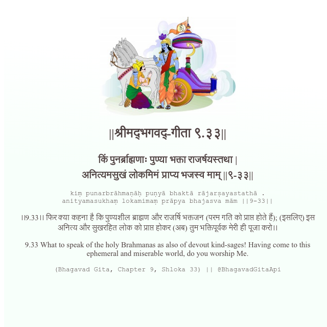

<h2>||श्रीमद्‍भगवद्‍-गीता ९.३३||</h2>
<h3>किं पुनर्ब्राह्मणाः पुण्या भक्ता राजर्षयस्तथा | अनित्यमसुखं लोकमिमं प्राप्य भजस्व माम् ||९-३३||</h3>
<pre>kiṃ punarbrāhmaṇāḥ puṇyā bhaktā rājarṣayastathā . anityamasukhaṃ lokamimaṃ prāpya bhajasva mām ||9-33||</pre>

।।9.33।। फिर क्या कहना है कि पुण्यशील ब्राह्मण और राजर्षि भक्तजन (परम गति को प्राप्त होते हैं); (इसलिए) इस अनित्य और सुखरहित लोक को प्राप्त होकर (अब) तुम भक्तिपूर्वक मेरी ही पूजा करो।।

<pre>(Bhagavad Gita, Chapter 9, Shloka 33) || @BhagavadGitaApi</pre>
https://docs.bhagavadgitaapi.in/

#API #bhagavadgitaapi #slok #nodejs #js #api #gitaapi #krishna #hinduism #vedic #ISKCON #shreemadbhagavadgita #technology

