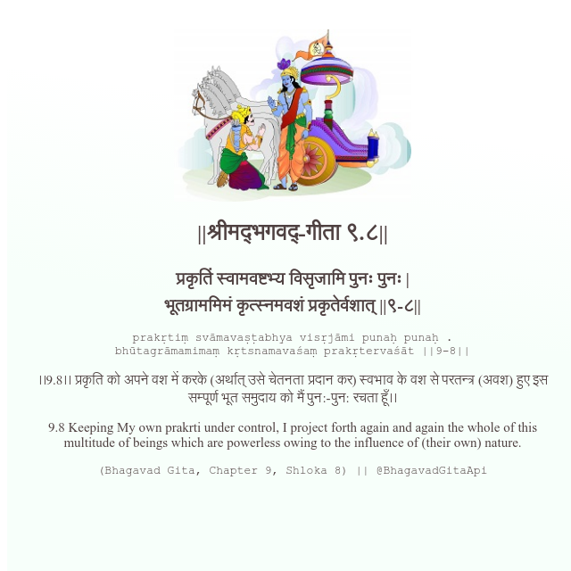

<h2>||श्रीमद्‍भगवद्‍-गीता ९.८||</h2>
<h3>प्रकृतिं स्वामवष्टभ्य विसृजामि पुनः पुनः | भूतग्राममिमं कृत्स्नमवशं प्रकृतेर्वशात् ||९-८||</h3>
<pre>prakṛtiṃ svāmavaṣṭabhya visṛjāmi punaḥ punaḥ . bhūtagrāmamimaṃ kṛtsnamavaśaṃ prakṛtervaśāt ||9-8||</pre>

।।9.8।। प्रकृति को अपने वश में करके (अर्थात् उसे चेतनता प्रदान कर) स्वभाव के वश से परतन्त्र (अवश) हुए इस सम्पूर्ण भूत समुदाय को मैं पुन:-पुन: रचता हूँ।।

<pre>(Bhagavad Gita, Chapter 9, Shloka 8) || @BhagavadGitaApi</pre>
https://bhagavadgitaapi.in/

#API #bhagavadgitaapi #slok #nodejs #js #api #gitaapi #krishna #hinduism #vedic #ISKCON #shreemadbhagavadgita #technology

