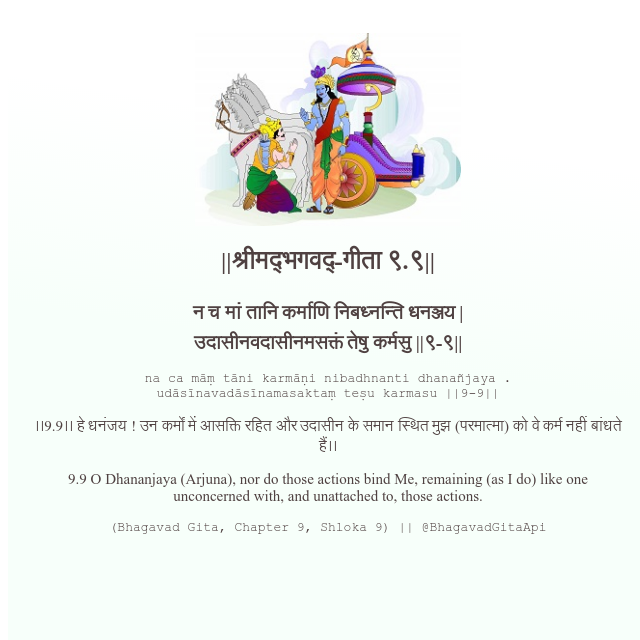

<h2>||श्रीमद्‍भगवद्‍-गीता ९.९||</h2>
<h3>न च मां तानि कर्माणि निबध्नन्ति धनञ्जय | उदासीनवदासीनमसक्तं तेषु कर्मसु ||९-९||</h3>
<pre>na ca māṃ tāni karmāṇi nibadhnanti dhanañjaya . udāsīnavadāsīnamasaktaṃ teṣu karmasu ||9-9||</pre>

।।9.9।। हे धनंजय ! उन कर्मों में आसक्ति रहित और उदासीन के समान स्थित मुझ (परमात्मा) को वे कर्म नहीं बांधते हैं।।

<pre>(Bhagavad Gita, Chapter 9, Shloka 9) || @BhagavadGitaApi</pre>
https://docs.bhagavadgitaapi.in/

#API #bhagavadgitaapi #slok #nodejs #js #api #gitaapi #krishna #hinduism #vedic #ISKCON #shreemadbhagavadgita #technology

